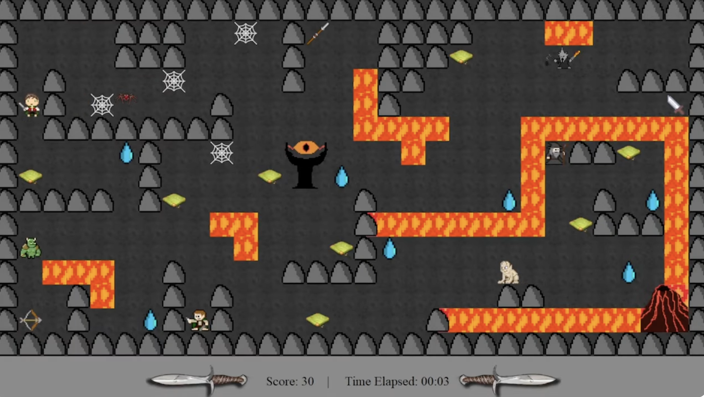

# Journey-Through-Mordor

## Description
A 2D platformer game set in the Lord of the Rings universe. Play as Frodo on a journey through Mordor. Collect rewards, avoid enemies, and reach Mount Doom to destroy the One Ring. Score drops below 0 and you lose; collect all rewards and reach Mount Doom to win.

### Tech Stack
Java, Java Swing, JUnit, JaCoCo, Apache Maven

## Preview


## Game Trailer
[Watch the trailer](https://www.youtube.com/watch?v=td1vKdk4mZs)

## Design


## Getting Started

### Build
```bash
mvn package
```

### Run
```bash
java -cp target/Phase-2-1.0.jar com.group21.app.Main
```

## Testing

### Running Tests
```bash
mvn clean compile test
```

### Code Coverage
```bash
mvn package
```
Navigate to `target/site/jacoco/index.html` to view the coverage report.

## Documentation
To generate JavaDocs:
```bash
mvn clean javadoc:javadoc
```
Navigate to `target/site/apidocs/index.html` to view the documentation.

## Contributors
- Jeffrey Wong
- Jessy Chahal
- Preet Dhadda
- Jimmy Hui
